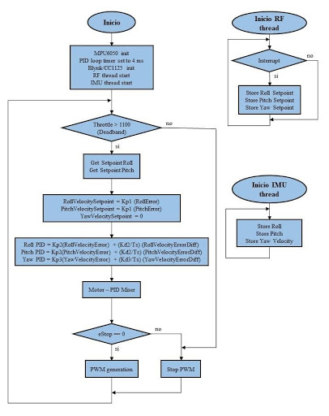

# EW ESP32 Flight Controller

This project is an **ESP32** based **Flight Controller**. This flight controller is designed to work with any quadrotor in X configuration, requiring only PID gains tuning.

# The Drone
This was tested on 19mmX19mm drone with tri-blade props similar to **SymaX5c**. Due to the light weight and low stiffness of these props, the sensors onboard neede **extreme low pass filters** to reduce the noise generated by the vibrations of these **unbalanced props**. Noise should decrease with higher quality props, allowing higher cut-off frecuencies for lpf's.

# The codes
This code was partially based on **Multiwii/Baseflight** sourcecodes, but adapted for specific sensors and functionalities required in this project. The flight control code uses **RTOS** to maintain a **constant PID sampling time**, while being able to continously receive RF control inputs.

Current enabled functionalities:
- Acro mode (Gyroscope-only stabilization)
- Altitude hold

# PID Control
This repo holds the simulink file containing the control solution for this project, wich is also described in terms of implementation through the following flow chart:  
  

# Components

For basic control of attitude and altitude the flight controller operates with a **6DOF IMU** and a **barometer**. The board used in this design uses **BMX055** or **MPU6050** for orientation and **MS5611** for altitude.

A **LiPo** battery is required for BLDC and ESC power. This was tested on a **3S 5200mAh** battery, but is able to support **2S** batteries.

## User Interface

The board has several connectivity options, including **WiFi**, **BLE** and **950MHz** rf protocol.
For WiFi and BLE, **Blynk** was used as a phone interface to control altitude and orientation.
For 950MHz rf protocol, a **custom remote control** was designed.
